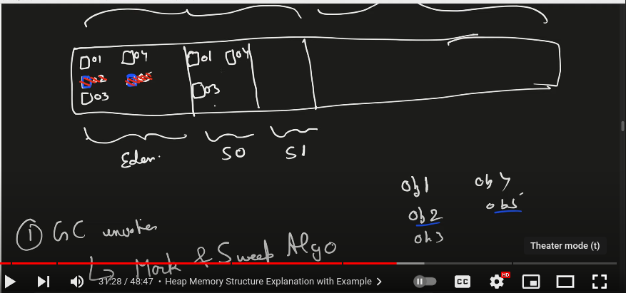

## Java memory management and garbage collection

### Types of memory(RAM):
1. STACK - primitive data types
2. HEAP - objects
---
N.B.
* main() method is first invoked.
* Both Stack and Heap are created by JVM and stored in RAM
* stack are associated with thread, each thread has one stack
* Heap is only one, all the objects, Strings are stored here 
* All objects reference is used in different stacks and scopes inside every stack.
---
### How memory gets populated:
1. **Stack Memory:**
   - Store temporary variables and separate memory block for methods
   - Store Primitive data types
   - Store Reference of the heap objects
     - _Strong reference_: Example:
       * ``Person person = new Person()``;
       * Here, person is a strong reference. 
       * The object will not be collected by the garbage collector as long as person is in scope and not set to null.
     - _Weak reference_: Example:
       * `` WeakReference<Person> weakPerson = new WeakReference<>(new Person()); ``
       * The WeakReference allows garbage collection to collect the Person object if there are no other strong references to it
       * If the garbage collector runs and there are no strong references to the Person object, it will be collected, and the weak reference will no longer be valid.
       * Use cases:
         1. Caching: Useful for caching scenarios where you want to keep objects in memory if possible but don't want them to be kept alive just because they are cached.
         2. Event Handlers: Helps in avoiding memory leaks caused by event handlers holding strong references to objects.
     - _Soft reference_: Example:
       * `` SoftReference<Person> softPerson = new SoftReference<>(new Person("John Doe")); ``
       * If sufficient space is available, the soft referenced object will not be deleted by GC
       * Allows garbage collection to collect the object only when memory is low.
       * If the JVM is running low on memory, the garbage collector will reclaim soft-referenced objects to free up memory
       * Use cases:
         1. Caching: Soft references are particularly useful for caches where you want to keep objects in memory as long as possible but also allow the garbage collector to reclaim them when memory is needed.
         2. Memory Management: Helps in applications with fluctuating memory usage by allowing the garbage collector to reclaim memory from soft-referenced objects during high memory demand.
   - Each thread has its own Stack memory, although we have only one heap for all the threads
   - Variables within a SCOPE is only visible and as soon as any variable goes out of the SCOPE, it gets deleted from the Stack(in LIFO order)
   - When Stack memory goes full, it throws "java.lang.StackOverflowError"

2. **Heap Memory**
    - Store objects
    - There is no order of allocating the memory
    - Garbage collector runs periodically (JVM runs)
    - System.gc() --method is run by JVM automatically to destroy unreferenced objects
    - Garbage collector is used to delete the unreferenced objects from the heap
      - Mark and Sweep Algorithm
      - Types of Garbage Collector:
        - Serial GC (only 1 thread was used, slow because application pauses during clean up)
        - Parallel GC (default  java 8, still slow as application pauses) 
        - CMS (Concurrent Mark & Sweep) (application thread and GC thread run parallel, but not 100% guaranteed. but compaction not happen. any way faster than previous two types)
        - G1 (latest versions of java: compaction and parallel both happens, fastest) ensures high throughput and less latency
    - Heap memory is shared with all the threads
    - Heap also contains the String pool
    - When Heap memory goes full, it throws "java.lang.OutOfMemoryError"
    - Heap memory is further divided into:
      - Young generation(Minor GC happens here)
        - Eden (objects are created get stored here first)
        - Survivor (After mark and sweep algorithm is run by GC, the survived objects are moved to s0)
          - s0 : age increments if not deleted by gc
          - s1 : age increments if not deleted by gc
      - Old/Tenured Generation(Major GC happens here) : there is a threshold(lets say age >=3) after that object moves to old generation from young generation
      - Permanent Generation(previously)/Non Heap(Meta space): stores following:
        - class variables
        - class metadata
        - constants
        - static 
        - final
      - How actually garbage collector works to collect the garbage(unreferenced objects) automatically:
      
    

### Code Example:
```java
public class Person{
    String name;
}

public class MemoryManagement{
    
    /*
     * As the main method is invoked at first, the main method will 
     * create its own scope where all the primitive variables and
     * the reference of the heap object will be stored
     * */
    public static void main(String[] args){
        /* primitive variable: number will be stored in the stack */
        int number =10;  
        /*
         * - non-primitive variable i.e. object(new Person())          
         * - object-instance will be stored in the heap
         * - object-reference (person) will be stored in the stack
         * */
        Person person = new Person(); 
        /*
         * - String literal(non primitive)
         * - String literal stores data into String pool
         * - String-pool is saved in the heap 
         * - Hence, "24" will be saved to the heap,
         * but it's reference (stringLiteral) will be saved to the stack 
         *  */
        String stringLiteral ="24";
        /*
         * -Another object
         * -new MemoryManagement() will be saved to heap
         * -memObj is the reference of the object, so it will be saved to the stack
         * */
        MemoryManagement memObj = new MemoryManagement();
        /*
         * Now, main() method has invoked another method (memoryManagementTest)
         * which will create its own scope in the stack.
         * In the newly created scope the memoryManagements variables will 
         * be stored
         * person is passed as argument, which is the reference of new Person() object
         * so, it will also be stored in the new scope
         * */
        memObj.memoryManagementTest(person);
        /*
         * As the scope of memoryManagementTest() method is deleted
         * Now again the code reaches to the closing curly bracket
         * Now the SCOPE of main method will also be deleted with all its variables from the stack
         * Now stack is empty, but heap is still having those objects and strings
         * Now HEAP will be freed those objects(unreferenced) by GARBAGE COLLECTOR 
         * */
    }
    /*
     * - This method will be invoked by the main method
     * - After the invocation, a new scope will be created in the stack
     * - as parameter, new Person() objects reference(person) is passed
     * so parameter - person will be saved to memoryManagement methods own scopes stack
     * */
    public void memoryManagementTest(
            Person person //reference of new Person() object will be saved to memoryManagement methods own scope
    ){
        /*Another reference of new Person() object i.e. person1 will also be saved to stack*/     
        Person person1 = person;
        /*
         * In the String pool "24" was previously saved, 
         * now the same "24" appears again
         * so stringLiteral1 will be referencing the same "24" previously saved in the heaps String pool
         * */
        String stringLiteral1 = "24";
        /*
         * Now a new object is created using new keyword
         * Although it may cause confusion that "24" is already in the string pool
         * but no, this is a new instance of String.
         * So, a new object will be created in the heap not in string pool
         * stringLiteral2 will reference the String object and will be saved to stack
         * */
        String stringLiteral2 = new String("24");
        /*
         * At this point no code is available and closing curly bracket is found
         * Now the memoryManagementTest methods SCOPE will be deleted
         * So all the variables(primitive) and object reference will also be deleted residing in the SCOPE in LIFO order 
         * Now the programs control will be again move to the main method
         */
    }
   
}
```