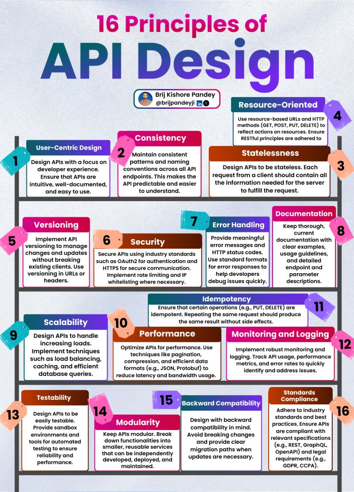

# 16 principles of API design to consider when creating your next API:

• 𝗥𝗲𝘀𝗼𝘂𝗿𝗰𝗲-𝗢𝗿𝗶𝗲𝗻𝘁𝗲𝗱: Use resource-based URLs and HTTP methods (GET, POST, PUT, DELETE) to reflect actions on resources. Ensure RESTful principles are adhered to.

• 𝗨𝘀𝗲𝗿-𝗖𝗲𝗻𝘁𝗿𝗶𝗰 𝗗𝗲𝘀𝗶𝗴𝗻: Design APIs with a focus on developer experience. Ensure that APIs are intuitive, well-documented, and easy to use.

• 𝗖𝗼𝗻𝘀𝗶𝘀𝘁𝗲𝗻𝗰𝘆: Maintain consistent patterns and naming conventions across all API endpoints. This makes the API predictable and easier to understand.

• 𝗦𝘁𝗮𝘁𝗲𝗹𝗲𝘀𝘀𝗻𝗲𝘀𝘀: Design APIs to be stateless. Each request from a client should contain all the information needed for the server to fulfill the request.

• 𝗩𝗲𝗿𝘀𝗶𝗼𝗻𝗶𝗻𝗴: Implement API versioning to manage changes and updates without breaking existing clients. Use versioning in URLs or headers.

• 𝗗𝗼𝗰𝘂𝗺𝗲𝗻𝘁𝗮𝘁𝗶𝗼𝗻: Keep thorough, current documentation with clear examples, usage guidelines, and detailed endpoint and parameter descriptions.

• 𝗘𝗿𝗿𝗼𝗿 𝗛𝗮𝗻𝗱𝗹𝗶𝗻𝗴: Provide meaningful error messages and HTTP status codes. Use standard formats for error responses to help developers debug issues quickly.

• 𝗦𝗲𝗰𝘂𝗿𝗶𝘁𝘆: Secure APIs using industry standards such as OAuth2 for authentication and HTTPS for secure communication. Implement rate limiting and IP whitelisting where necessary.

• 𝗜𝗱𝗲𝗺𝗽𝗼𝘁𝗲𝗻𝗰𝘆: Ensure that certain operations (e.g., PUT, DELETE) are idempotent. Repeating the same request should produce the same result without side effects.

• 𝗦𝗰𝗮𝗹𝗮𝗯𝗶𝗹𝗶𝘁𝘆: Design APIs to handle increasing loads. Implement techniques such as load balancing, caching, and efficient database queries.

• 𝗣𝗲𝗿𝗳𝗼𝗿𝗺𝗮𝗻𝗰𝗲: Optimize APIs for performance. Use techniques like pagination, compression, and efficient data formats (e.g., JSON, Protobuf) to reduce latency and bandwidth usage.

• 𝗧𝗲𝘀𝘁𝗮𝗯𝗶𝗹𝗶𝘁𝘆: Design APIs to be easily testable. Provide sandbox environments and tools for automated testing to ensure reliability and performance.

• 𝗠𝗼𝗻𝗶𝘁𝗼𝗿𝗶𝗻𝗴 𝗮𝗻𝗱 𝗟𝗼𝗴𝗴𝗶𝗻𝗴: Implement robust monitoring and logging. Track API usage, performance metrics, and error rates to quickly identify and address issues.

• 𝗠𝗼𝗱𝘂𝗹𝗮𝗿𝗶𝘁𝘆: Keep APIs modular. Break down functionalities into smaller, reusable services that can be independently developed, deployed, and maintained.

• 𝗕𝗮𝗰𝗸𝘄𝗮𝗿𝗱 𝗖𝗼𝗺𝗽𝗮𝘁𝗶𝗯𝗶𝗹𝗶𝘁𝘆: Design with backward compatibility in mind. Avoid breaking changes and provide clear migration paths when updates are necessary.

• 𝗦𝘁𝗮𝗻𝗱𝗮𝗿𝗱𝘀 𝗖𝗼𝗺𝗽𝗹𝗶𝗮𝗻𝗰𝗲: Adhere to industry standards and best practices. Ensure APIs are compliant with relevant specifications (e.g., REST, GraphQL, OpenAPI) and legal requirements (e.g., GDPR, CCPA).

