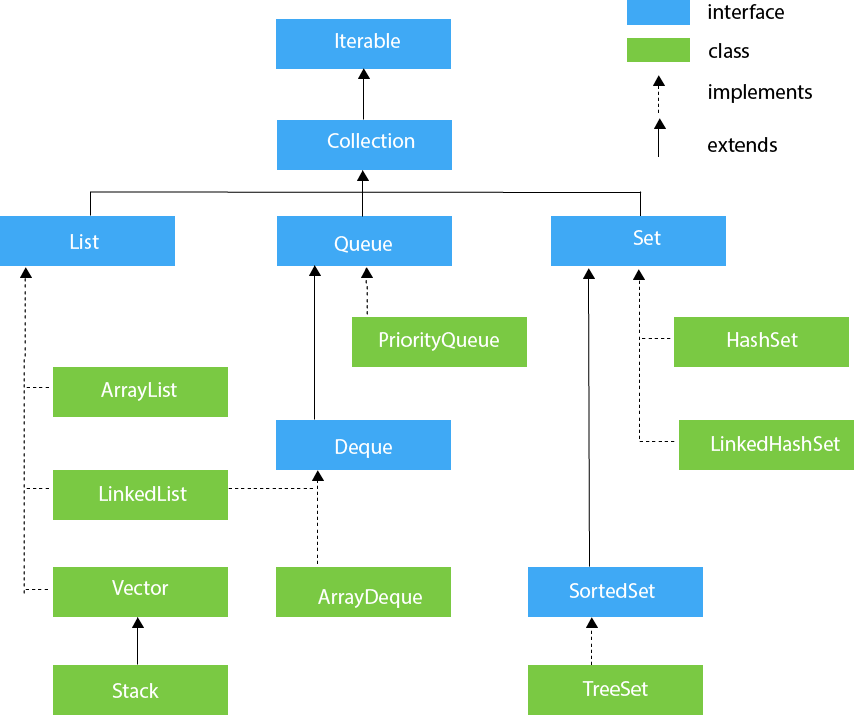

# Java Collection Framework

## What is java collection framework?
- Collection is nothing but a group of Objects
- Present in java.util package
- Framework provide us the architecture to manage these "group of objects" i.e. add, update, delete, search etc.

## Why we need java collection framework?
- Prior to JCF, we have Array, Vector, Hash Tables
- But problem with that is, there is no  common interface, so its difficult to remember the methods for each.

```java
import java.util.ArrayList;
import java.util.List;

List<Integer> numbers = new ArrayList<>();

```
